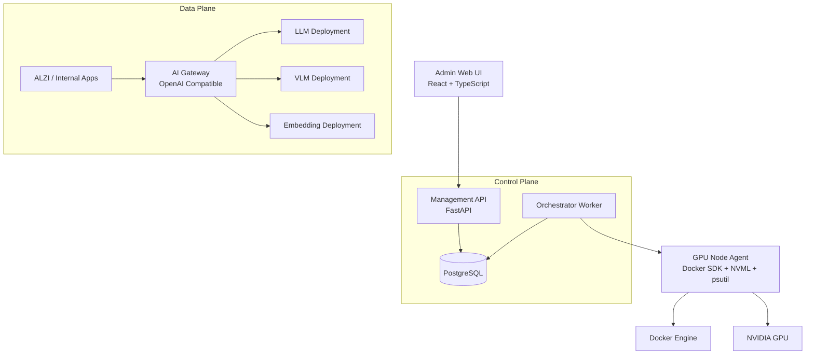

# MVP Architecture

## 1. Architecture Goal

ModelOps의 MVP는 단순 GPU 대시보드가 아니라 **Model Serving Control Plane + AI Gateway**로 구성한다.

가장 중요한 요구사항은 다음과 같다.

- 관리 시스템 장애가 기존 AI 추론 장애로 이어지지 않아야 한다.
- 업무시스템은 실제 모델 Container의 주소를 알 필요가 없어야 한다.
- 모델 배포·중지·교체는 Resource Preflight와 Health Check를 거쳐야 한다.
- Docker/GPU 직접 제어 권한은 GPU Node Agent로 제한한다.

## 2. Logical Architecture



## 3. Component Responsibilities

### 3.1 Admin Web UI

관리자용 화면이다.

주요 기능:

- 전체 Node/GPU 자원 상태
- 모델 목록 및 버전
- Deployment 목록 및 상태
- Endpoint Alias 라우팅 상태
- 신규 배포 요청
- Start / Stop / Restart
- 모델 변경 요청
- Resource Preflight 결과
- Operation 진행 상태
- 호출량 / latency / 오류 현황
- Audit 및 변경 이력

### 3.2 Management API

관리 UI의 요청을 수신하고 운영 상태를 DB에 기록한다.

책임:

- Model Registry CRUD
- Model Version CRUD
- Deployment 메타정보 관리
- Endpoint Alias 관리
- Node/GPU 상태 조회
- Operation 생성
- 요청 유효성 검증
- Audit 기록

Management API는 Docker Engine을 직접 제어하지 않는다.

### 3.3 Orchestrator Worker

실제 Deployment Operation을 순차 실행한다.

주요 단계:

1. Resource Preflight
2. Model File 준비 여부 확인
3. Docker Image 준비 여부 확인
4. Deployment Config 검증
5. Node Agent 호출
6. Container Start/Stop/Restart
7. Health Check
8. Inference Probe
9. Endpoint Route Switch
10. 실패 시 Rollback

MVP에서는 Redis/Celery 없이 PostgreSQL Job Table을 사용한다.

권장 Worker Claim 방식:

```sql
SELECT ...
FROM operation_job
WHERE status = 'QUEUED'
ORDER BY created_at
FOR UPDATE SKIP LOCKED
LIMIT 1;
```

### 3.4 GPU Node Agent

GPU 서버에서 Host 수준 자원과 Docker Engine을 직접 다루는 유일한 컴포넌트이다.

책임:

- Docker Container inspect/start/stop/restart/remove
- Docker stats 수집
- NVIDIA NVML 기반 GPU 정보 수집
- Host CPU/RAM/Disk 수집
- Deployment Container 로그 조회
- Container PID ↔ GPU Process 매핑
- Deployment Health Probe 보조

Node Agent에는 임의 shell/exec API를 제공하지 않는다.

권장 Internal API:

```text
GET  /internal/v1/resources
GET  /internal/v1/deployments
POST /internal/v1/deployments/{id}/start
POST /internal/v1/deployments/{id}/stop
POST /internal/v1/deployments/{id}/restart
GET  /internal/v1/deployments/{id}/logs
GET  /internal/v1/deployments/{id}/health
```

Node Agent는 Docker Container보다는 `systemd` Host Service를 우선 권장한다.

### 3.5 AI Gateway

사내 업무시스템이 호출하는 단일 AI 진입점이다.

지원 인터페이스 예:

```text
POST /v1/chat/completions
POST /v1/embeddings
GET  /v1/models
```

업무시스템은 실제 모델 이름 대신 논리 Alias를 사용한다.

```json
{
  "model": "company-llm",
  "messages": [
    {"role": "user", "content": "안녕하세요"}
  ]
}
```

Gateway는 `company-llm`을 활성 Deployment로 변환하고 필요하면 upstream의 실제 served model name으로 rewrite한다.

### 3.6 PostgreSQL

Control Plane의 운영 상태와 이력을 저장한다.

주요 데이터 범주:

- Node / GPU Device
- Model / Model Version
- Deployment
- Endpoint Alias / Route
- Operation / Operation Step
- Resource Snapshot
- Health Snapshot
- Invocation Log
- Audit Log

세부 ERD는 다음 설계 단계에서 확정한다.

## 4. Resource Monitoring

Node Agent는 NVML과 Host Metrics를 사용한다.

### GPU

- GPU UUID
- GPU Model
- VRAM Total / Used / Free
- GPU Utilization
- Memory Utilization
- Temperature
- Power
- Compute Process PID
- Process VRAM Usage

### Host

- CPU Utilization
- RAM Total / Used / Free
- Disk Capacity / Free

### Container

- CPU Usage
- Memory Usage
- Network RX/TX
- Uptime
- Restart Count

GPU Process PID와 Container PID를 매핑하여 Deployment별 실측 VRAM을 계산한다. 매핑 불가 시 `observed_vram`은 `NULL`로 유지하며 0으로 간주하지 않는다.

## 5. Resource Preflight

신규 Deployment 또는 모델 교체 전에 자원 사전 검사를 수행한다.

기본 개념:

```text
Available = Free VRAM - Safety Margin
```

신규 모델의 예상 Peak VRAM과 비교한다.

판정 결과:

```text
HOT_SWITCH_AVAILABLE
COLD_SWITCH_ONLY
RESOURCE_INSUFFICIENT
```

예상 VRAM은 다음 요소를 고려한다.

- Model Weights
- KV Cache
- CUDA Runtime
- Runtime Overhead
- Context Length
- Batch/Concurrency
- Safety Margin

운영 이후에는 예상값과 실측 Idle/Average/Peak 값을 함께 축적한다.

## 6. Model File Strategy

모델 파일은 Container 시작 시 외부에서 매번 내려받지 않는다.

권장 Host 구조:

```text
/srv/ai-models/
├── qwen3-14b-awq/
│   └── <revision>/
├── qwen-vl/
│   └── <revision>/
└── bge-m3/
    └── <revision>/
```

Container에는 read-only volume으로 mount한다.

Cold Switch 수행 전 아래 준비를 완료하여 실제 서비스 중단시간에서 다운로드 시간을 제외한다.

- Model download
- Checksum/revision 검증
- Docker image pull
- Runtime configuration 검증

## 7. Runtime Adapter

Runtime별 실행 차이를 Orchestrator에서 직접 분기하지 않고 Adapter로 격리한다.

```text
RuntimeAdapter
├── VLLMAdapter
├── EmbeddingAdapter
└── GenericOpenAIAdapter
```

Adapter 책임:

- Docker Image 결정
- Command 생성
- Environment 생성
- Volume 구성
- GPU Device 할당
- Health Endpoint 정의
- Served Model Name 정의

## 8. Health Model

Container Runtime 상태와 AI 모델 Health 상태는 분리한다.

Runtime Status:

```text
CREATED
RUNNING
STOPPED
FAILED
```

Health Status:

```text
UNKNOWN
STARTING
HEALTHY
DEGRADED
UNHEALTHY
```

Gateway에 연결 가능한 기본 조건:

```text
runtime_status = RUNNING
AND health_status = HEALTHY
```

Health는 두 단계로 확인한다.

- L1: HTTP Health Check
- L2: 최소 Inference Probe

일반 모니터링에서는 L1을 자주 실행하고 Endpoint 전환 직전에는 L2까지 성공해야 한다.

## 9. Gateway Routing

DB의 논리 관계:

```text
Endpoint Alias
      │
      ▼
Active Deployment
      │
      ▼
Actual Upstream
```

예:

```text
company-llm
  -> deployment-0023
  -> qwen3-14b deployment
```

Gateway는 매 요청마다 PostgreSQL을 조회하지 않는다.

메모리 Route Cache 예:

```text
company-llm       -> deployment-23
company-vlm       -> deployment-12
company-embedding -> deployment-7
```

Route 변경 시 PostgreSQL `LISTEN/NOTIFY`를 사용하고, 이벤트 유실 대비 `route_version`을 주기적으로 확인한다.

DB 장애 시에는 Last Known Good Route를 유지한다.

## 10. Invocation Logging

Gateway에서 기본 저장할 정보:

- request_id
- requested_at
- client_id
- source_ip
- endpoint_alias
- deployment_id
- model_id
- API path/type
- HTTP status
- latency_ms
- input/output/total tokens
- request/response bytes
- streaming 여부
- error_code

Prompt/Response 본문은 기본적으로 저장하지 않는다.

업무시스템은 아래 헤더 사용을 권장한다.

```http
X-AI-Client: alzi
```

미제공 시 `unknown`으로 기록한다.

## 11. Deployment Types

### IMPORTED

기존에 이미 실행 중인 모델이다.

- 기존 endpoint 유지 가능
- Gateway proxy 대상 등록 가능
- 모니터링 중심
- 관리시스템의 Container lifecycle 제어는 제한

### MANAGED

ModelOps가 lifecycle을 관리한다.

- Create
- Start
- Stop
- Restart
- Health Check
- Resource Tracking
- Switch/Rollback

기존 서비스는 `IMPORTED → Gateway Proxy → MANAGED` 순으로 단계 전환한다.

## 12. Failure Isolation

| Failure | Impact |
|---|---|
| Frontend 장애 | 기존 추론 영향 없음 |
| Management API 장애 | 기존 추론 영향 없음 |
| Worker 장애 | 신규 배포/변경 불가, 기존 추론 정상 |
| PostgreSQL 장애 | Gateway의 Last Known Good Route 사용 |
| Node Agent 장애 | 관리 기능 제한, 기존 모델 정상 |
| Gateway 장애 | AI 호출 장애 |
| Model Runtime 장애 | 해당 Endpoint 영향 |

MVP의 운영 우선순위는 Gateway와 Model Runtime의 가용성이다.

## 13. Initial Migration Flow

```text
기존
Internal App -> Fixed Model Endpoint

1단계
기존 Endpoint를 IMPORTED Deployment로 등록

2단계
Internal App -> AI Gateway -> 기존 Endpoint

3단계
ModelOps Managed Deployment 도입

4단계
Endpoint Alias -> Managed Deployment
```

Gateway 이관과 Container lifecycle 관리 도입을 분리하여 위험을 낮춘다.
