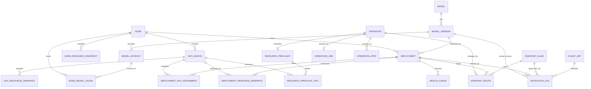

# ModelOps Data Model / ERD

## 1. 설계 목표

ModelOps 데이터 모델은 다음 요구사항을 우선한다.

1. Model, Model Version, Deployment, Endpoint Alias를 분리한다.
2. 실제 모델 교체 이력을 삭제하지 않고 추적할 수 있어야 한다.
3. Hot Switch / Cold Switch / Rollback이 동일한 Operation 모델 위에서 동작해야 한다.
4. GPU가 여러 장인 Node와 Tensor Parallel Deployment를 지원할 수 있어야 한다.
5. Control Plane 장애 시 Gateway가 마지막 정상 Route를 유지할 수 있어야 한다.
6. 자원 사전점검 결과와 실측 VRAM을 비교·축적할 수 있어야 한다.
7. 호출 로그에는 Prompt/Response 본문을 기본 저장하지 않는다.
8. 운영 이력 보존을 위해 주요 엔터티는 물리 삭제보다 비활성/보관을 우선한다.

---

## 2. 핵심 도메인 구분

### Infrastructure

- `node`
- `gpu_device`
- `node_resource_snapshot`
- `gpu_resource_snapshot`

### Model Registry

- `model`
- `model_version`
- `model_artifact`
- `node_model_cache`

### Serving / Deployment

- `deployment`
- `deployment_gpu_assignment`
- `deployment_resource_snapshot`
- `health_check`

### Routing

- `endpoint_alias`
- `endpoint_route`
- `routing_state`

### Orchestration

- `operation`
- `operation_job`
- `operation_step`
- `resource_preflight`
- `resource_preflight_gpu`

### Observability / Audit

- `client_app`
- `invocation_log`
- `audit_log`

---

## 3. Core ERD



`routing_state`는 Gateway가 전체 Route 변경을 감지하기 위한 singleton 성격의 테이블이므로 ERD 관계선보다 전역 상태로 취급한다.

---

## 4. 핵심 관계 설명

### 4.1 Model → Model Version

`model`은 논리적인 모델 계열이다.

예:

```text
Qwen3 14B
```

`model_version`은 실제 배포 가능한 구체 버전이다.

예:

```text
Qwen3-14B / revision abc123 / AWQ / vLLM
```

같은 Model이라도 revision, quantization, runtime image, context 설정이 다르면 다른 Model Version으로 관리한다.

### 4.2 Model Version → Deployment

`deployment`는 특정 Model Version이 실제 Node에서 실행되는 인스턴스다.

```text
Model Version
   Qwen3-14B-AWQ rev abc123
        │
        ├── Deployment A / Node 01 / GPU 0
        └── Deployment B / Node 02 / GPU 0,1
```

따라서 Model Version 자체에는 현재 실행 위치나 Container 상태를 저장하지 않는다.

### 4.3 Deployment ↔ GPU Device

하나의 Deployment가 여러 GPU를 사용할 수 있으므로 `deployment_gpu_assignment`를 둔다.

```text
Deployment 23
  ├── GPU 0 / device_order 0
  └── GPU 1 / device_order 1
```

Tensor Parallel 또는 추후 multi-GPU runtime을 데이터 모델 변경 없이 지원할 수 있다.

### 4.4 Endpoint Alias → Endpoint Route → Deployment

업무시스템은 `endpoint_alias`만 사용한다.

```text
company-llm
     │
     ▼
endpoint_route (ACTIVE)
     │
     ▼
deployment-0023
```

Alias에 `active_deployment_id`를 직접 저장하지 않고 Route 엔터티를 분리한다.

이유:

- 전환 전/후 Deployment 이력 보존
- Rollback 대상 확인
- 어떤 Operation이 Route를 변경했는지 추적
- Gateway Route Cache 재구성
- 향후 Canary/Weighted Routing 확장 여지

MVP에서는 Alias별 ACTIVE Route는 정확히 1개만 허용한다.

### 4.5 Operation

모든 운영 변경은 `operation`으로 추적한다.

대표 유형:

```text
DEPLOY
START
STOP
RESTART
SWITCH
ROLLBACK
DELETE
IMPORT
```

`operation`은 사용자 관점의 업무 단위이고, `operation_job`은 Worker가 가져가는 실행 큐다.

```text
Operation
   │
   ├── Operation Job
   │      QUEUED → RUNNING → DONE
   │
   └── Operation Steps
          PRECHECK
          PREPARE
          STOP_OLD
          START_NEW
          HEALTH_CHECK
          SWITCH_ROUTE
          ...
```

Cold Switch의 상세 상태명은 별도 상태머신 설계에서 확정한다.

### 4.6 Resource Preflight

모델 신규 배포 또는 Switch 전에 계산한 판단 근거를 별도 저장한다.

```text
resource_preflight
  result = COLD_SWITCH_ONLY
  required_peak_vram_mb = 52000
  available_hot_vram_mb = 33000
  available_after_reclaim_mb = 91000
```

여러 GPU가 있으면 GPU별 상세값은 `resource_preflight_gpu`에 저장한다.

이 데이터는 단순 임시 계산값이 아니라 모델별 예상 VRAM 정확도를 개선하는 운영 근거로 활용한다.

---

## 5. Infrastructure Model

### node

GPU 서버 단위다.

주요 속성:

- `id`
- `name`
- `hostname`
- `agent_base_url`
- `environment`
- `region`
- `status`
- `last_heartbeat_at`
- `cpu_model`
- `ram_total_mb`
- `disk_total_mb`
- `labels_json`
- `created_at`
- `updated_at`

`agent_base_url`은 운영 DB에는 필요하지만 Public Repository의 seed/example에는 실제 내부 주소를 넣지 않는다.

### gpu_device

Node에 설치된 실제 GPU 카드다.

주요 속성:

- `id`
- `node_id`
- `gpu_uuid`
- `device_index`
- `model_name`
- `vram_total_mb`
- `compute_capability`
- `safety_margin_mb`
- `status`
- `last_seen_at`

`gpu_uuid`를 물리 GPU의 안정 식별자로 사용하고 `device_index`는 현재 Host의 ordinal 값으로 취급한다.

---

## 6. Model Registry Model

### model

논리 모델 계열.

주요 속성:

- `id`
- `slug`
- `name`
- `model_type` (`LLM`, `VLM`, `EMBEDDING`)
- `provider`
- `source_type`
- `license_name`
- `description`
- `is_active`
- `created_at`
- `updated_at`

### model_version

실제 배포 가능한 모델 버전.

주요 속성:

- `id`
- `model_id`
- `version_label`
- `source_repository`
- `source_revision`
- `quantization`
- `dtype`
- `runtime_type`
- `runtime_image`
- `runtime_image_digest`
- `served_model_name`
- `expected_idle_vram_mb`
- `expected_peak_vram_mb`
- `default_max_model_len`
- `runtime_config_json`
- `archived_at`
- `created_at`
- `updated_at`

`runtime_config_json`에는 runtime별 가변 설정을 둔다.

예:

```json
{
  "tensor_parallel_size": 1,
  "gpu_memory_utilization": 0.8,
  "max_model_len": 32768
}
```

자주 검색/검증하는 핵심 필드는 JSONB에 숨기지 않고 정규 컬럼으로 둔다.

### model_artifact

Model Version을 구성하는 모델 파일 artifact 정보다.

주요 속성:

- `id`
- `model_version_id`
- `artifact_type`
- `source_uri`
- `revision`
- `checksum`
- `size_bytes`
- `created_at`

### node_model_cache

특정 Node에 해당 Artifact가 준비되어 있는지 나타낸다.

주요 속성:

- `id`
- `node_id`
- `model_artifact_id`
- `status` (`MISSING`, `PREPARING`, `READY`, `FAILED`)
- `local_path`
- `verified_checksum`
- `prepared_at`
- `last_verified_at`
- `error_message`

Cold Switch 전에 신규 모델 파일을 미리 다운로드하고 검증했는지 판단하는 근거다.

---

## 7. Deployment Model

### deployment

주요 속성:

- `id`
- `name`
- `model_version_id`
- `node_id`
- `deployment_type` (`IMPORTED`, `MANAGED`)
- `desired_state`
- `runtime_status`
- `health_status`
- `container_id`
- `container_name`
- `upstream_base_url`
- `runtime_port`
- `deployment_config_json`
- `last_started_at`
- `last_stopped_at`
- `last_health_at`
- `status_reason`
- `created_at`
- `updated_at`
- `retired_at`

`container_id`, `container_name`은 IMPORTED Deployment에서는 NULL일 수 있다.

`upstream_base_url`은 Gateway가 실제 요청을 전달할 위치다. MANAGED Deployment에서는 내부 Docker network 주소를 사용하고 IMPORTED Deployment에서는 기존 Endpoint를 사용할 수 있다.

### deployment_gpu_assignment

주요 속성:

- `deployment_id`
- `gpu_device_id`
- `device_order`
- `expected_vram_mb`
- `created_at`

PK는 `(deployment_id, gpu_device_id)` 복합키 또는 별도 UUID + UNIQUE 제약 중 구현 단계에서 선택할 수 있다. MVP에서는 단순 복합 UNIQUE를 권장한다.

---

## 8. Routing Model

### endpoint_alias

업무시스템에 노출되는 논리 모델 식별자.

주요 속성:

- `id`
- `alias`
- `display_name`
- `api_type` (`CHAT`, `EMBEDDING`)
- `description`
- `is_enabled`
- `created_at`
- `updated_at`

예:

```text
company-llm
company-vlm
company-embedding
```

### endpoint_route

Alias와 실제 Deployment의 연결 이력.

주요 속성:

- `id`
- `endpoint_alias_id`
- `deployment_id`
- `status` (`ACTIVE`, `INACTIVE`)
- `rewrite_model_name`
- `operation_id`
- `activated_at`
- `deactivated_at`
- `created_at`

핵심 제약:

```sql
CREATE UNIQUE INDEX uq_endpoint_route_active_alias
ON endpoint_route(endpoint_alias_id)
WHERE status = 'ACTIVE';
```

따라서 Alias 하나에 활성 Route가 둘 이상 생기지 않는다.

### routing_state

Gateway Route Cache 갱신용 singleton.

주요 속성:

- `id` = 1
- `version` BIGINT
- `updated_at`

Route 변경 Transaction에서 다음을 함께 처리한다.

```text
1. 기존 ACTIVE Route 비활성화
2. 신규 Route ACTIVE
3. routing_state.version + 1
4. COMMIT
5. PostgreSQL NOTIFY
```

Gateway는 NOTIFY를 놓쳐도 주기적으로 `routing_state.version`을 비교하여 재동기화한다.

---

## 9. Operation / Orchestration Model

### operation

주요 속성:

- `id`
- `operation_type`
- `status`
- `switch_strategy`
- `endpoint_alias_id`
- `source_deployment_id`
- `target_deployment_id`
- `requested_by`
- `request_reason`
- `idempotency_key`
- `error_code`
- `error_message`
- `metadata_json`
- `created_at`
- `started_at`
- `finished_at`

`switch_strategy` 예:

```text
HOT
COLD
ALTERNATE_NODE
```

SWITCH가 아닌 Operation에서는 NULL이다.

### operation_job

Worker durable queue.

주요 속성:

- `id`
- `operation_id`
- `status`
- `priority`
- `attempt_count`
- `max_attempts`
- `available_at`
- `locked_by`
- `locked_at`
- `last_error`
- `created_at`
- `updated_at`

Worker는 `FOR UPDATE SKIP LOCKED`로 QUEUED Job을 claim한다.

### operation_step

Operation의 세부 실행 이력.

주요 속성:

- `id`
- `operation_id`
- `sequence_no`
- `step_code`
- `status`
- `attempt_no`
- `started_at`
- `finished_at`
- `error_code`
- `error_message`
- `detail_json`

동일 Operation 내 `(sequence_no, attempt_no)` 또는 `(step_code, attempt_no)`를 유일하게 관리한다.

---

## 10. Resource Preflight Model

### resource_preflight

주요 속성:

- `id`
- `operation_id`
- `node_id`
- `target_model_version_id`
- `source_deployment_id`
- `result`
- `required_peak_vram_mb`
- `available_hot_vram_mb`
- `reclaimable_vram_mb`
- `available_after_reclaim_mb`
- `safety_margin_mb`
- `detail_json`
- `checked_at`

`result`:

```text
HOT_SWITCH_AVAILABLE
COLD_SWITCH_ONLY
RESOURCE_INSUFFICIENT
```

### resource_preflight_gpu

GPU별 판단 상세.

주요 속성:

- `id`
- `resource_preflight_id`
- `gpu_device_id`
- `free_vram_mb`
- `reclaimable_vram_mb`
- `safety_margin_mb`
- `required_vram_mb`
- `available_hot_vram_mb`
- `available_after_reclaim_mb`
- `result`

---

## 11. Monitoring / Observability Model

### node_resource_snapshot

Node 단위 시계열.

- `node_id`
- `sampled_at`
- `cpu_utilization_pct`
- `ram_total_mb`
- `ram_used_mb`
- `ram_free_mb`
- `disk_total_mb`
- `disk_used_mb`
- `disk_free_mb`

### gpu_resource_snapshot

GPU 단위 시계열.

- `gpu_device_id`
- `sampled_at`
- `vram_total_mb`
- `vram_used_mb`
- `vram_free_mb`
- `gpu_utilization_pct`
- `memory_utilization_pct`
- `temperature_c`
- `power_w`

### deployment_resource_snapshot

Deployment에 귀속시킨 실측 사용량.

- `deployment_id`
- `gpu_device_id`
- `sampled_at`
- `observed_vram_mb`
- `container_cpu_pct`
- `container_memory_mb`

PID ↔ Container 매핑에 실패하면 `observed_vram_mb`는 NULL이다. 0으로 대체하지 않는다.

### health_check

- `deployment_id`
- `check_type` (`HTTP`, `INFERENCE`)
- `result`
- `latency_ms`
- `http_status`
- `error_code`
- `error_message`
- `checked_at`

---

## 12. Invocation / Client Model

### client_app

인증 목적이 아니라 운영상 호출 주체를 식별하기 위한 등록 정보다.

- `id`
- `client_key`
- `display_name`
- `description`
- `is_active`
- `created_at`
- `updated_at`

예:

```http
X-AI-Client: internal-search
```

미등록 또는 헤더가 없는 요청도 차단하지 않는다.

### invocation_log

- `id`
- `request_id`
- `requested_at`
- `client_app_id`
- `raw_client_key`
- `source_ip`
- `endpoint_alias_id`
- `deployment_id`
- `model_version_id`
- `api_path`
- `http_status`
- `latency_ms`
- `input_tokens`
- `output_tokens`
- `total_tokens`
- `request_bytes`
- `response_bytes`
- `is_streaming`
- `error_code`

Prompt/Response 본문 컬럼은 MVP 기본 Schema에 두지 않는다.

---

## 13. Audit Model

### audit_log

관리 API를 통해 발생한 설정 변경을 추적한다.

- `id`
- `occurred_at`
- `actor`
- `action`
- `entity_type`
- `entity_id`
- `operation_id`
- `before_json`
- `after_json`
- `request_id`

Model/Version/Deployment/Endpoint Route 변경은 Audit 대상이다.

---

## 14. 주요 무결성 규칙

### Route

- Alias별 ACTIVE Route는 최대 1개다.
- `is_enabled = false`인 Alias는 Gateway 신규 요청을 라우팅하지 않는다.
- Route 활성화 대상 Deployment는 서비스 계층에서 `runtime_status = RUNNING` + `health_status = HEALTHY`를 확인해야 한다.
- ACTIVE Route가 참조 중인 Deployment는 retire/delete할 수 없다.

### Deployment

- `MANAGED`는 `node_id`, `container_name`이 필수다.
- `IMPORTED`는 `upstream_base_url`이 필수다.
- 하나의 Node에 없는 GPU를 Deployment에 할당할 수 없다.
- 동일 Deployment에 같은 GPU를 중복 할당할 수 없다.

### Model

- Model Version에 Deployment 이력이 있으면 물리 삭제하지 않고 archive 처리한다.
- Model도 운영 이력이 있으면 `is_active=false`로 처리한다.

### Operation

- 동일 `idempotency_key` 요청은 중복 Operation을 생성하지 않는다.
- 같은 Endpoint Alias에 대한 SWITCH/ROLLBACK Operation은 동시에 둘 이상 RUNNING하지 못하도록 서비스 계층 및 DB lock으로 보호한다.

---

## 15. 삭제 / 보존 정책

ModelOps는 운영 이력 추적이 중요하므로 기본 정책은 다음과 같다.

| 데이터 | 정책 |
|---|---|
| Model | 비활성화 우선 |
| Model Version | archive 우선 |
| Deployment | container 제거 후 record는 `retired_at`으로 보존 |
| Endpoint Alias | disable 우선 |
| Endpoint Route | 영구 이력 보존 |
| Operation / Step | 장기 보존 |
| Audit Log | 장기 보존 |
| Invocation Log | 설정 가능한 단기 보존 |
| Resource Snapshot | 설정 가능한 단기 보존 또는 downsampling |
| Health Check | 설정 가능한 단기 보존 |

MVP 기본값 제안:

- Invocation Log: 30일 상세 보존
- Resource Snapshot: 14일 상세 보존
- Health Check: 14일 상세 보존
- Operation/Audit/Route: 삭제하지 않음

보존기간은 운영환경 설정값으로 두고 코드 상수로 고정하지 않는다.

---

## 16. 물리 Schema 원칙

- PostgreSQL 사용
- PK는 기본적으로 UUID
- 시간은 `TIMESTAMPTZ`
- VRAM/RAM 값은 MB 단위 `BIGINT` 또는 `INTEGER`
- 파일 크기/Network byte는 `BIGINT`
- IP는 PostgreSQL `INET`
- 가변 Runtime 설정은 `JSONB`
- 상태값은 MVP에서 `VARCHAR` + Application Enum을 기본으로 하고 핵심 컬럼에 CHECK 제약을 추가한다.
- PostgreSQL Native ENUM은 상태 추가 시 migration 결합도가 높아 초기 MVP에서는 사용하지 않는다.
- 모든 mutable master table에 `created_at`, `updated_at`을 둔다.

---

## 17. 설계상 의도적으로 넣지 않은 것

현재 MVP에서는 다음을 별도 엔터티로 만들지 않는다.

- 사용자/권한/RBAC
- API Key
- Billing/Quota
- Model Benchmark
- Fine-tuning Job
- Dataset Registry
- Kubernetes Resource
- Canary/Weighted Traffic Policy

필요 시 현재 Route/Operation/Deployment 구조 위에 추가할 수 있도록 경계를 유지한다.

---

## 18. 다음 설계와의 연결

Cold Switch 상태머신은 아래 데이터를 직접 사용한다.

```text
operation
operation_job
operation_step
resource_preflight
resource_preflight_gpu
node_model_cache
deployment
endpoint_route
routing_state
health_check
```

따라서 다음 단계에서는 별도 데이터 구조를 새로 만들기보다 이 엔터티들의 상태 전이와 Transaction 경계를 정의한다.
