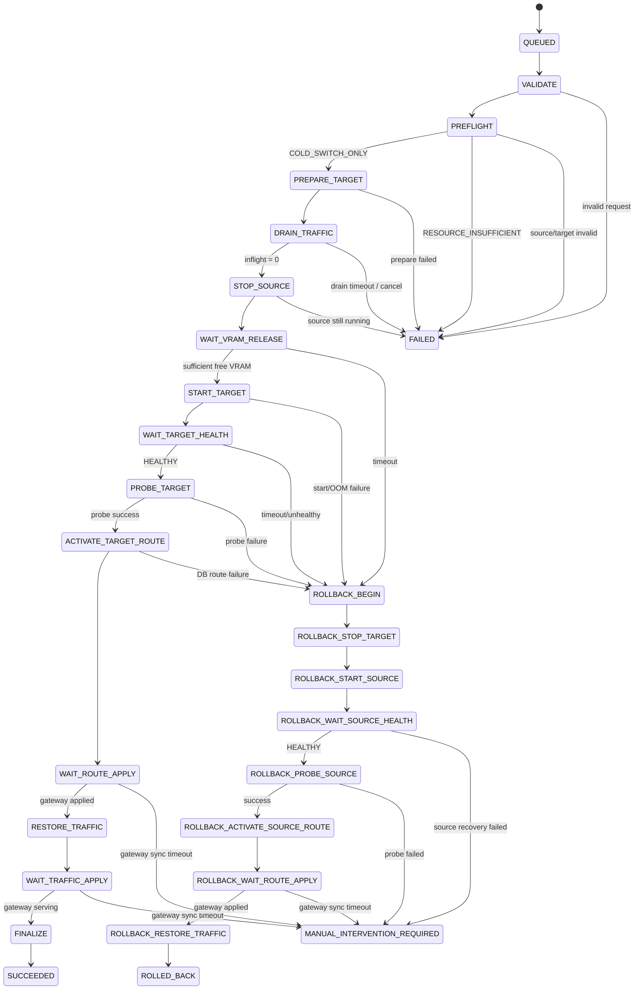

# Cold Switch State Machine

## 1. 목적

Cold Switch는 GPU VRAM이 부족하여 기존 모델과 신규 모델을 동시에 실행할 수 없는 경우 안전하게 모델을 교체하기 위한 상태머신이다.

핵심 원칙은 다음과 같다.

1. 신규 모델 파일과 Docker Image는 기존 모델을 중지하기 전에 준비한다.
2. 실제 모델 중지 전 최신 자원 상태로 Resource Preflight를 다시 수행한다.
3. 기존 모델 중지 전 신규 요청을 차단하고 진행 중 요청을 drain한다.
4. 기존 모델이 중지된 뒤에는 단순 취소하지 않고 실패 시 Rollback을 수행한다.
5. 신규 모델은 HTTP Health Check와 Inference Probe를 모두 통과해야 Route 대상이 될 수 있다.
6. Route 전환은 DB Transaction으로 원자적으로 처리한다.
7. Control Plane 또는 Worker가 재시작되어도 마지막 상태부터 재개할 수 있어야 한다.
8. 각 외부 side effect는 재실행 가능한 idempotent 동작으로 설계한다.

---

## 2. Cold Switch 전제

예:

```text
GPU Total                 80 GB
현재 Free                 13 GB
기존 Model 사용량         58 GB
신규 Model Peak 예상      46 GB
Safety Margin              8 GB
```

Hot Switch에는 최소 54 GB가 필요하지만 현재 Free는 13 GB이므로 불가능하다.

기존 모델 종료 후 예상 가용량은 충분하므로 Resource Preflight 결과는 다음과 같다.

```text
COLD_SWITCH_ONLY
```

Cold Switch에서는 두 모델을 동시에 띄우지 않는다.

```text
기존 Model RUNNING
       ↓
Traffic Drain
       ↓
기존 Model STOP
       ↓
VRAM Release 확인
       ↓
신규 Model START
       ↓
Health / Inference Probe
       ↓
Route Switch
       ↓
Traffic Resume
```

---

## 3. Operation 상태와 Step 상태 분리

`operation.status`는 사용자와 API에 노출되는 상위 상태다.

권장 값:

```text
QUEUED
RUNNING
ROLLING_BACK
SUCCEEDED
FAILED
ROLLED_BACK
CANCELLED
MANUAL_INTERVENTION_REQUIRED
```

세부 진행상태는 `operation_step.step_code`에 기록한다.

Cold Switch의 Step Code:

```text
VALIDATE
PREFLIGHT
PREPARE_TARGET
DRAIN_TRAFFIC
STOP_SOURCE
WAIT_VRAM_RELEASE
START_TARGET
WAIT_TARGET_HEALTH
PROBE_TARGET
ACTIVATE_TARGET_ROUTE
WAIT_ROUTE_APPLY
RESTORE_TRAFFIC
WAIT_TRAFFIC_APPLY
FINALIZE
```

Rollback Step Code:

```text
ROLLBACK_BEGIN
ROLLBACK_BLOCK_TRAFFIC
ROLLBACK_STOP_TARGET
ROLLBACK_START_SOURCE
ROLLBACK_WAIT_SOURCE_HEALTH
ROLLBACK_PROBE_SOURCE
ROLLBACK_ACTIVATE_SOURCE_ROUTE
ROLLBACK_WAIT_ROUTE_APPLY
ROLLBACK_RESTORE_TRAFFIC
ROLLBACK_FINALIZE
```

---

## 4. 전체 상태머신



`STOP_SOURCE`가 성공한 이후부터는 서비스가 기존 상태로 자동 복귀하려면 Source 모델 재기동이 필요하다. 이 지점을 **Rollback Required Boundary**로 본다.

---

## 5. Traffic State 보강

Cold Switch에서는 기존 모델을 중지하기 전에 Gateway 신규 요청을 차단해야 한다.

따라서 `endpoint_alias`에 다음 런타임 상태를 추가한다.

```text
traffic_state
```

권장 값:

```text
SERVING
DRAINING
MAINTENANCE
```

기존 `is_enabled`와 역할을 분리한다.

- `is_enabled=false`: 관리자가 Endpoint 자체를 비활성화한 상태
- `traffic_state`: 활성 Endpoint의 일시적인 운영 상태

Gateway 처리 규칙:

| is_enabled | traffic_state | 처리 |
|---|---|---|
| false | any | 503 / Endpoint disabled |
| true | SERVING | ACTIVE Route로 정상 전달 |
| true | DRAINING | 신규 요청 503, 기존 in-flight 요청은 계속 처리 |
| true | MAINTENANCE | 신규 요청 503, upstream 전달 금지 |

Cold Switch 중 Gateway의 503 응답 권장 형태:

```http
HTTP/1.1 503 Service Unavailable
Retry-After: 30
```

```json
{
  "error": {
    "message": "The model endpoint is temporarily unavailable during model switching.",
    "type": "service_unavailable",
    "code": "MODEL_SWITCH_IN_PROGRESS"
  }
}
```

이 호출도 `invocation_log`에는 저장하되 Prompt/Response 본문은 저장하지 않는다.

---

## 6. Gateway 적용 확인

DB의 `traffic_state`나 Route를 변경했다고 즉시 모든 Gateway가 적용했다고 가정하면 안 된다.

MVP Gateway는 내부 상태조회 API를 제공한다.

예:

```text
GET /internal/v1/routes/{alias}/runtime
```

응답 개념:

```json
{
  "alias": "company-llm",
  "applied_routing_version": 31,
  "traffic_state": "DRAINING",
  "active_deployment_id": "...",
  "inflight_requests": 0
}
```

Worker는 다음 조건을 확인한 후 다음 Step으로 이동한다.

```text
Gateway applied_routing_version >= requested routing version
```

MVP는 Gateway 1개를 전제로 할 수 있지만, 향후 다중 Gateway 환경에서는 정상 상태인 모든 Gateway instance의 적용 완료를 확인하도록 확장한다.

---

## 7. 단계별 상세 설계

### 7.1 VALIDATE

검증 항목:

- Endpoint Alias 존재 및 enabled 여부
- ACTIVE Route 존재
- Source Deployment와 ACTIVE Route 일치
- Source Deployment `RUNNING + HEALTHY`
- Target Deployment 또는 Target Model Version 존재
- Source와 Target이 동일하지 않은지
- Node Agent heartbeat 정상 여부
- 대상 Node/GPU 접근 가능 여부
- 동일 Alias에 다른 Switch/Rollback Operation이 실행 중이지 않은지

실패하면 Source에 영향을 주지 않고 `FAILED` 처리한다.

### 7.2 PREFLIGHT

Node Agent에서 최신 NVML/Docker 상태를 다시 수집한다.

판단 예:

```text
required_target_vram
    = target expected_peak_vram
      + safety_margin

available_hot_vram
    = current_free_vram

available_after_reclaim
    = current_free_vram
      + source observed_vram
      - safety_margin
```

Cold Switch 진행 조건:

```text
available_hot_vram < required_target_vram
AND
available_after_reclaim >= target expected_peak_vram
```

`source observed_vram`은 최근 NVML 측정값을 우선한다.

Source VRAM을 신뢰성 있게 측정할 수 없고 Target 배포 가능성을 보수적으로 판단할 수도 없다면 자동 Cold Switch를 차단하고 관리자 확인 대상으로 남긴다.

Preflight 결과는 `resource_preflight` 및 `resource_preflight_gpu`에 보존한다.

### 7.3 PREPARE_TARGET

이 단계에서는 Target Model을 GPU에 기동하지 않는다.

확인/준비 항목:

- Model Artifact 존재
- Source Revision 및 checksum 검증
- `node_model_cache.status = READY`
- Docker Image pull 완료
- Runtime image digest 확인
- Runtime Adapter config 생성/검증
- Volume mount path 존재
- GPU assignment 결정
- Container name 충돌 확인
- Health endpoint / served model name 확정

준비 실패 시 기존 Source는 계속 서비스 중이므로 `FAILED`로 종료한다.

### 7.4 DRAIN_TRAFFIC

Route는 아직 Source를 가리킨다.

Transaction:

```text
endpoint_alias.traffic_state = DRAINING
routing_state.version += 1
COMMIT
NOTIFY
```

그 후 Worker는 Gateway가 DRAINING 상태를 적용했는지 확인한다.

```text
applied version 확인
       ↓
inflight_requests 확인
       ↓
0이면 다음 단계
```

Drain timeout 전에는 Source가 여전히 실행 중이므로 안전하게 Switch를 중단할 수 있다.

중단 시:

```text
traffic_state = SERVING
routing_state.version += 1
```

으로 복구하고 `FAILED` 또는 사용자 취소인 경우 `CANCELLED` 처리한다.

장시간 streaming 요청 때문에 drain timeout이 발생할 수 있으므로 timeout은 설정값으로 둔다.

권장 MVP 기본값:

```text
drain_timeout_seconds = 60
```

### 7.5 STOP_SOURCE

Drain 완료 후 먼저 `traffic_state = MAINTENANCE`로 전환하여 신규 요청이 절대로 Source로 전달되지 않게 한다.

Gateway 적용을 확인한 뒤 Node Agent에 Source stop을 요청한다.

```text
POST /internal/v1/deployments/{source}/stop
```

Node Agent의 stop 동작은 idempotent해야 한다.

이미 STOPPED라면 성공으로 처리한다.

확인 조건:

```text
container runtime != RUNNING
```

Source stop 요청이 시작된 이후는 **Rollback Required Boundary**다.

사용자 Cancel 요청도 이 지점 이후에는 즉시 취소가 아니라 `ROLLBACK_REQUESTED` 의미로 처리한다.

### 7.6 WAIT_VRAM_RELEASE

Docker가 STOPPED라고 바로 VRAM이 반환됐다고 가정하지 않는다.

Node Agent/NVML로 다음을 확인한다.

1. Source GPU process가 사라짐
2. Target 실행에 필요한 실제 Free VRAM 확보

통과 조건:

```text
free_vram >= target_expected_peak_vram + safety_margin
```

여러 GPU를 사용하면 Target이 할당받을 모든 GPU가 조건을 만족해야 한다.

권장 timeout:

```text
vram_release_timeout_seconds = 30
```

Timeout이면 Target을 시작하지 않고 Rollback한다.

### 7.7 START_TARGET

Node Agent에 Target start를 요청한다.

```text
POST /internal/v1/deployments/{target}/start
```

Start 요청은 idempotent해야 한다.

확인:

```text
deployment.runtime_status = RUNNING
health_status = STARTING
```

다음 오류는 즉시 Rollback 대상으로 본다.

- CUDA OOM
- Container exited
- Invalid runtime config
- Model load fatal error
- GPU device unavailable

OOM 상황에서 동일 설정으로 무제한 재시작하지 않는다.

### 7.8 WAIT_TARGET_HEALTH

L1 HTTP Health를 Polling한다.

통과 조건:

```text
runtime_status = RUNNING
AND health_status = HEALTHY
```

권장 최대 대기시간은 Model Version/Runtime별 설정으로 둔다.

예:

```text
startup_timeout_seconds = 300
```

Timeout 또는 UNHEALTHY이면 Rollback한다.

### 7.9 PROBE_TARGET

실제 최소 추론 요청을 수행한다.

LLM/VLM 예:

```text
/v1/chat/completions
```

Embedding 예:

```text
/v1/embeddings
```

Probe 검증 항목:

- HTTP 성공
- 응답 JSON 형식
- served model 식별 가능 여부
- 최소 timeout 이내 응답

Probe 실패 시 아직 외부 Route는 Source를 가리키고 있고 Traffic은 MAINTENANCE 상태이므로 Rollback한다.

### 7.10 ACTIVATE_TARGET_ROUTE

Target이 HEALTHY이고 Probe에 성공한 후에만 Route를 변경한다.

DB Transaction:

```text
BEGIN

SELECT endpoint_alias
FOR UPDATE

기존 ACTIVE Route -> INACTIVE
신규 Target Route -> ACTIVE
routing_state.version += 1

COMMIT
NOTIFY
```

중요:

```text
traffic_state는 MAINTENANCE 유지
```

즉 Route를 Target으로 변경했더라도 아직 외부 요청은 받지 않는다.

### 7.11 WAIT_ROUTE_APPLY

Gateway가 신규 Route를 메모리 캐시에 적용했는지 확인한다.

통과 조건:

```text
applied_routing_version >= target route version
AND
active_deployment_id = target_deployment_id
AND
traffic_state = MAINTENANCE
```

Target은 정상인데 Gateway 동기화가 실패한 경우 기존 Source를 무조건 재기동하는 것은 이득이 없을 수 있다.

따라서 일정 시간 재시도 후에도 Gateway 적용을 확인할 수 없으면:

```text
MANUAL_INTERVENTION_REQUIRED
```

로 두고 Traffic은 MAINTENANCE 상태를 유지한다.

Gateway가 복구되면 Operation reconciliation을 통해 자동 재개할 수 있도록 구현한다.

### 7.12 RESTORE_TRAFFIC

Gateway가 Target Route 적용을 확인하면:

```text
traffic_state = SERVING
routing_state.version += 1
```

으로 변경한다.

그 후 Gateway 적용을 다시 확인한다.

### 7.13 FINALIZE

최종 확인:

```text
Endpoint Alias
  traffic_state = SERVING
  ACTIVE Route = Target

Source Deployment
  desired_state = STOPPED
  runtime_status = STOPPED

Target Deployment
  desired_state = RUNNING
  runtime_status = RUNNING
  health_status = HEALTHY
```

Operation:

```text
status = SUCCEEDED
finished_at = now()
```

Audit Log에 Source/Target, Strategy, Preflight 결과, Route 변경을 기록한다.

---

## 8. Rollback 설계

### 8.1 Rollback 기본 원칙

Source가 중지된 후 실패하면 Source 재기동을 우선한다.

```text
Traffic MAINTENANCE
        ↓
Target Stop
        ↓
Source Start
        ↓
Source Health
        ↓
Source Inference Probe
        ↓
Source Route 복구
        ↓
Gateway Route 적용 확인
        ↓
Traffic SERVING
```

### 8.2 Route가 아직 Source인 경우

Target Route 활성화 전 실패했다면 `endpoint_route`는 여전히 Source ACTIVE다.

이 경우 Source를 재기동하고 정상 확인한 후 Traffic만 `SERVING`으로 복구하면 된다.

### 8.3 Route가 이미 Target인 경우

`ACTIVATE_TARGET_ROUTE` 이후 실패하여 Rollback이 필요하면:

1. Traffic을 MAINTENANCE로 유지/변경
2. 필요 시 Target Stop
3. Source Start
4. Source Health + Probe
5. Source Route를 다시 ACTIVE로 전환
6. Gateway Route 적용 확인
7. Traffic SERVING

Route 복구 역시 하나의 DB Transaction으로 수행한다.

### 8.4 Source 재기동 실패

다음과 같은 상황에서는 자동 복구가 불가능할 수 있다.

- Source Image/Artifact 손상
- Source도 GPU OOM 발생
- Docker/GPU 장애
- Node Agent 장애
- Source Health/Probe 지속 실패

이 경우:

```text
operation.status = MANUAL_INTERVENTION_REQUIRED
endpoint_alias.traffic_state = MAINTENANCE
```

상태를 유지한다.

실패 상황에서 임의의 다른 모델로 자동 연결하지 않는다.

---

## 9. 실패 지점별 처리 정책

| 실패 지점 | Source 상태 | 자동 처리 |
|---|---|---|
| VALIDATE | RUNNING | FAILED, 영향 없음 |
| PREFLIGHT | RUNNING | FAILED, 영향 없음 |
| PREPARE_TARGET | RUNNING | FAILED, 영향 없음 |
| DRAIN_TRAFFIC | RUNNING | SERVING 복구 후 FAILED/CANCELLED |
| STOP_SOURCE | RUNNING 또는 불명 | 상태 확인 후 SERVING 복구 또는 Rollback |
| WAIT_VRAM_RELEASE | STOPPED | Source Rollback |
| START_TARGET | STOPPED | Target 정리 후 Source Rollback |
| WAIT_TARGET_HEALTH | STOPPED | Target Stop 후 Source Rollback |
| PROBE_TARGET | STOPPED | Target Stop 후 Source Rollback |
| ACTIVATE_TARGET_ROUTE | STOPPED | Route 상태 확인 후 Source Rollback |
| WAIT_ROUTE_APPLY | STOPPED / Target HEALTHY | Gateway 재동기화 우선, 장기 실패 시 Manual |
| RESTORE_TRAFFIC | Target HEALTHY | Gateway 재동기화 우선 |

---

## 10. Retry 정책

Retry는 모든 단계에서 동일하게 적용하지 않는다.

### 안전한 Retry

- Node/GPU 상태 조회
- Docker inspect
- Artifact 확인
- Image 존재 확인
- Gateway applied version 조회
- Health check
- Route Transaction의 transient DB failure

### 제한 Retry

- Docker stop/start
- Image pull
- Probe

동일한 CUDA OOM, invalid config 같은 결정적 오류는 단순 Retry하지 않는다.

권장 backoff:

```text
1s -> 2s -> 5s -> 10s
```

정확한 횟수와 timeout은 Step별 설정으로 관리한다.

---

## 11. Worker 장애 및 재시작 복구

Worker는 Step을 메모리에서만 관리하면 안 된다.

각 Step은:

```text
PENDING
RUNNING
SUCCEEDED
FAILED
```

상태를 DB에 기록한다.

외부 명령 전:

```text
operation_step = RUNNING
COMMIT
```

외부 명령 후 실제 상태를 다시 관찰하고:

```text
operation_step = SUCCEEDED
COMMIT
```

한다.

Worker가 중간에 죽으면 새 Worker는 Step을 무조건 처음부터 반복하지 않고 실제 상태를 reconcile한다.

예:

```text
현재 Step = STOP_SOURCE
실제 Source = STOPPED

=> STOP 명령 재전송 없이 WAIT_VRAM_RELEASE로 진행 가능
```

```text
현재 Step = START_TARGET
실제 Target = RUNNING

=> WAIT_TARGET_HEALTH로 진행
```

```text
현재 Step = ACTIVATE_TARGET_ROUTE
실제 ACTIVE Route = Target

=> WAIT_ROUTE_APPLY로 진행
```

Node Agent start/stop API도 동일 상태 요청을 성공으로 처리해야 한다.

---

## 12. 동시 실행 제어

동일 Endpoint Alias에 Switch 두 개가 동시에 실행되면 안 된다.

MVP에서는 Worker가 PostgreSQL Advisory Lock을 사용한다.

논리 Lock 예:

```text
endpoint:{endpoint_alias_id}
node:{node_id}
```

Cold Switch Operation이 시작되면 Alias Lock과 필요한 Node Lock을 획득한다.

장기 Transaction row lock을 유지하지 않고 Advisory Lock은 Worker DB session 범위에서 유지한다.

Worker 장애 시 DB session 종료와 함께 Lock이 해제된다.

Operation 재개 시 Lock을 다시 획득하고 DB/Node/Gateway 실제 상태를 reconcile한 후 계속한다.

`idempotency_key`도 함께 사용하여 동일 사용자 요청의 중복 Operation 생성을 방지한다.

---

## 13. Cancel 정책

### Source 중지 전

다음 단계에서는 취소 가능하다.

```text
VALIDATE
PREFLIGHT
PREPARE_TARGET
DRAIN_TRAFFIC
```

DRAIN 중 취소하면 Traffic을 SERVING으로 복구한 뒤 `CANCELLED` 처리한다.

### Source 중지 시작 후

```text
STOP_SOURCE 이후
```

에는 단순 Cancel을 허용하지 않는다.

사용자 Cancel 요청은:

```text
ROLLBACK_REQUESTED
```

로 해석하여 안전하게 Source 복구 절차를 수행한다.

---

## 14. 권장 Timeout 설정

MVP 기본값 예시이며 모델별로 override할 수 있다.

| 설정 | 기본값 | 설명 |
|---|---:|---|
| gateway_apply_timeout | 30s | Route/Traffic state 적용 확인 |
| drain_timeout | 60s | 기존 in-flight 요청 소진 |
| source_stop_timeout | 60s | Source container 종료 |
| vram_release_timeout | 30s | NVML VRAM 반환 확인 |
| target_start_timeout | 60s | Container RUNNING 전환 |
| target_health_timeout | 300s | 모델 Loading/Health |
| inference_probe_timeout | 60s | 최소 추론 확인 |
| rollback_source_health_timeout | 300s | Source 복구 Health |

VLM/대형 LLM 등 로딩 시간이 긴 모델은 `model_version` 또는 deployment config에서 개별 설정한다.

---

## 15. 사용자 UI 표시

Cold Switch 실행 전 다음 내용을 명확히 보여준다.

```text
Qwen A -> Qwen B

전환 방식           Cold Switch
현재 Free VRAM       13 GB
Target 예상 Peak     46 GB
Safety Margin         8 GB
Source 회수 예상     58 GB

무중단 전환          불가
서비스 중단          발생
Target 사전 준비      완료
Rollback              가능
```

실행 중에는 Step을 사용자 친화적으로 표현한다.

```text
1. 사전 검증                  완료
2. 신규 모델 준비             완료
3. 기존 요청 종료 대기         완료
4. 기존 모델 종료              완료
5. GPU 메모리 반환 확인         완료
6. 신규 모델 시작              진행 중
7. 신규 모델 정상 확인          대기
8. Endpoint 전환               대기
9. 서비스 재개                 대기
```

내부 Step Code를 그대로 UI에 노출할 필요는 없다.

---

## 16. API 실행 흐름 권장

API 명세 단계에서 상세 URL은 확정하되 흐름은 다음을 권장한다.

### 1) 사전 분석

```text
사용자 -> Switch Preflight 요청
       -> HOT_SWITCH_AVAILABLE / COLD_SWITCH_ONLY / RESOURCE_INSUFFICIENT
```

### 2) 사용자 확인

Cold Switch인 경우 UI에서 서비스 중단 가능성을 명시하고 확인을 받는다.

### 3) Operation 생성

```text
confirm_cold_switch = true
preflight_id = <preview result>
```

을 포함하여 Switch Operation을 생성한다.

단, Worker는 실행 직전에 실제 GPU 상태로 Preflight를 반드시 다시 수행한다. UI Preview 결과만 신뢰하지 않는다.

---

## 17. DB Transaction 경계

긴 모델 Start/Stop/Health 대기 동안 DB Transaction을 열어두지 않는다.

Transaction은 짧게 유지한다.

### Step 상태 변경

```text
BEGIN
operation_step update
operation update
COMMIT
```

### Traffic State 변경

```text
BEGIN
endpoint_alias traffic_state update
routing_state.version += 1
COMMIT
NOTIFY
```

### Route Switch

```text
BEGIN
endpoint_alias SELECT FOR UPDATE
old route -> INACTIVE
new route -> ACTIVE
routing_state.version += 1
COMMIT
NOTIFY
```

Docker/API 호출, 모델 Loading 대기, Health Polling 중에는 DB Transaction을 유지하지 않는다.

---

## 18. 정상 완료 시 최종 상태

```text
operation
  status = SUCCEEDED
  switch_strategy = COLD

endpoint_alias
  traffic_state = SERVING

endpoint_route
  Source = INACTIVE
  Target = ACTIVE

source_deployment
  desired_state = STOPPED
  runtime_status = STOPPED

target_deployment
  desired_state = RUNNING
  runtime_status = RUNNING
  health_status = HEALTHY
```

---

## 19. Rollback 완료 시 최종 상태

```text
operation
  status = ROLLED_BACK

endpoint_alias
  traffic_state = SERVING

endpoint_route
  Source = ACTIVE
  Target = INACTIVE

source_deployment
  desired_state = RUNNING
  runtime_status = RUNNING
  health_status = HEALTHY

target_deployment
  desired_state = STOPPED
```

Rollback 성공은 Switch 성공이 아니다. UI/Audit에서는 `ROLLED_BACK`을 별도 결과로 명확히 표시한다.

---

## 20. MVP 구현 기준

Cold Switch MVP에서 반드시 구현한다.

- Resource Preflight 재검증
- Target Artifact/Image 사전 준비
- Gateway Traffic Drain
- In-flight request 확인
- Source Stop
- NVML 기반 VRAM Release 확인
- Target Start
- L1 Health Check
- L2 Inference Probe
- Transactional Route Switch
- Gateway Route 적용 확인
- Traffic Resume
- 자동 Rollback
- Worker 재시작 Reconciliation
- Alias/Node 동시작업 Lock
- Operation/Step/Audit 이력

후속 확장:

- Multi-Gateway quorum 적용 확인
- 예약 전환
- 유지보수 Window
- 사용자 정의 Drain 정책
- Canary/Weighted Routing
- 모델별 자동 startup timeout 학습
